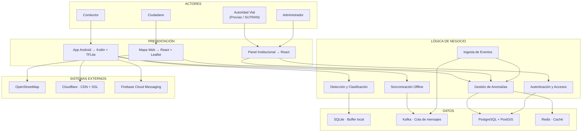

# Arquitectura Inicial del Sistema

## Diagrama de arquitectura

## Descripción

La arquitectura se organiza en tres capas principales:

- **Presentación:** la app Android es el punto de entrada del conductor; el mapa web es accesible para cualquier ciudadano sin registro; el panel institucional requiere autenticación y está destinado a autoridades viales y administradores.

- **Lógica de negocio:** contiene los módulos de detección y clasificación de anomalías (ejecutados localmente en el dispositivo), sincronización offline con patrón Store-and-Forward, ingesta de eventos vía Kafka, gestión del mapa de anomalías y control de accesos por roles.

- **Datos:** SQLite actúa como buffer local en el dispositivo, Kafka absorbe la ráfaga de sincronizaciones simultáneas, PostgreSQL con PostGIS almacena las anomalías geolocalizadas y Redis gestiona la caché del mapa público.

El sistema nace como monolito modular. Cada módulo tiene responsabilidades claras y puede extraerse como servicio independiente conforme el sistema crezca, sin necesidad de reescribir la lógica de negocio.